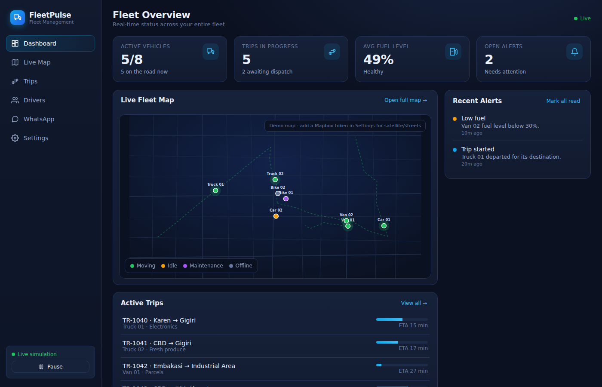

# FleetPulse — Fleet Management Demo

A self-contained **fleet management** demo with live map tracking and **WhatsApp**
dispatch. Everything runs in the browser — no backend, no accounts, no API keys
required. State persists to `localStorage`, and a built-in simulation keeps the
fleet moving in real time.



## Features

- **Login screen** — a demo sign-in (no real auth; any email works, credentials pre-filled). Session persists across refreshes; sign out from the user menu.
- **Live fleet dashboard** — active vehicles, trips in progress, fuel levels, and open alerts at a glance.
- **Real-time map** — vehicles move along routes with animated markers, status colours, and per-vehicle detail. Renders on a built-in demo map by default; drop in a **Mapbox** token for real street/satellite tiles.
- **Fleet management** — full CRUD for vehicles: add, edit (name, plate, type, fuel, assigned driver), and delete, with confirmation.
- **Driver management** — full CRUD for the driver roster: add, edit (name, WhatsApp number, rating), delete, and one-click messaging.
- **WhatsApp dispatch** — a WhatsApp-style two-way inbox for every driver, with delivery/read ticks and an **auto-reply bot** that answers driver keywords (`STATUS`, `ETA`, `FUEL`, `ARRIVED`, `MENU`).
- **Trip management** — create trips, **dispatch** them to a vehicle (the driver is auto-notified over WhatsApp), and track progress/ETA to completion.
- **Live simulation** — vehicles drive their routes, fuel drains, ETAs update, and drivers send messages and trigger alerts. Pause/resume any time.

Built with accessible [Radix UI](https://www.radix-ui.com/) primitives (dialogs, dropdown menus, selects, switches, tooltips, toasts) on a hand-written design system.

## Getting started

```bash
npm install
npm run dev
```

Open the printed URL (default `http://localhost:5173`). To build for production:

```bash
npm run build && npm run preview
```

## How the demo works

Because this is a **demo running fully in demo mode**, there is no server:

- **State** lives in `localStorage` (`fleetpulse.state.v1`) via a tiny observable store (`src/lib/store.ts`). Reset it any time from **Settings → Reset demo data**.
- **Simulation** (`src/lib/simulation.ts`) ticks once per second, advancing vehicle positions along their routes, updating trips, and injecting driver chatter and alerts.
- **Map** (`src/components/FleetMap.tsx`) renders a real basemap and steps down one rung at a time if something is unavailable: Mapbox streets (valid token) → MapLibre + free OpenStreetMap raster tiles → the schematic SVG preview (only if the map libraries themselves fail to load). Whenever it steps down, the reason is shown in the map's corner badge and logged to the console.

### Mapbox integration

Optional — without a token the map still renders real streets via OpenStreetMap.
Two ways to enable Mapbox tiles:

- **Settings → Mapbox Integration** — paste a token; it's stored in `localStorage`.
- **Build-time** — copy `.env.example` to `.env` and set `VITE_MAPBOX_TOKEN`.

Get a free token at [account.mapbox.com](https://account.mapbox.com). Mapbox GL is
code-split, so it's only downloaded when a token is present.

**Deploying with a token (Vercel).** `VITE_MAPBOX_TOKEN` is inlined by Vite at
**build** time, not read at request time, so:

1. Add it under **Project Settings → Environment Variables**, enabled for the
   **Production** environment (not only Preview/Development).
2. **Redeploy** — an existing deployment keeps the value it was built with. A
   redeploy served from build cache will not pick up a changed variable either.
3. Paste the raw token, with no surrounding quotes. It must be a **public**
   token (`pk.…`); a secret `sk.…` token cannot be used from a browser.
4. If the token has **URL restrictions**, add the deployment's origin
   (e.g. `https://your-app.vercel.app`) to the allowed list, or Mapbox answers
   `403`.

**Checking a live deployment.** Open **Settings → Mapbox Integration** and press
**Test token**. It calls the Mapbox styles API from the browser with whatever
token the app is actually using and reports the real status (`200`, `401`
unauthorized, `403` URL-restricted, or blocked network). The same panel says
whether the active token came from `VITE_MAPBOX_TOKEN` or from one saved in this
browser — a token saved in Settings **overrides** the deployed one, which is a
common reason a correct Vercel token appears to be ignored.

### WhatsApp integration

In demo mode all conversations are simulated in the browser. The production wiring
for the **WhatsApp Business Cloud API** is documented and stubbed in
`src/lib/whatsapp.ts`, which shows exactly where outbound sends and the inbound
webhook would connect. To go live you would:

1. Move the access token to a server and have the app call your backend (never ship WhatsApp secrets to the browser).
2. Point `sendWhatsApp()` at that backend.
3. Add a webhook endpoint that maps inbound WhatsApp messages to `receiveMessage(driverId, body)`.

## Tech stack

- **React 18** + **TypeScript** + **Vite**
- **Radix UI** primitives, styled with a hand-written design system (`src/index.css`)
- **mapbox-gl** (optional, lazy-loaded)

## Project structure

```
src/
  components/     FleetMap, Sidebar, Icon
    ui/           Radix wrappers: Dialog, ConfirmDialog, Select, Switch,
                  RowMenu, Tooltip, Toast
  pages/          Login, Dashboard, MapView, Fleet, Trips, Drivers,
                  WhatsApp, Settings
  lib/            types, store, actions, simulation, geo, whatsapp,
                  auth, env, format
  hooks/          useStore
  data/           seed (Nairobi-based demo fleet)
```

> This is a demonstration app. It uses seeded, fictional data around Nairobi, Kenya.
